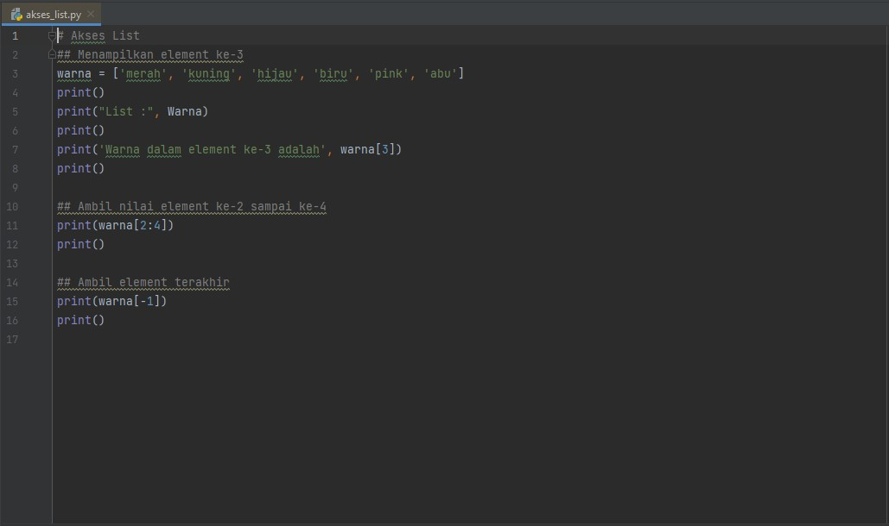
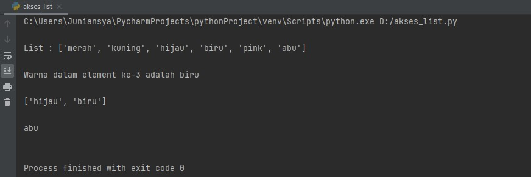
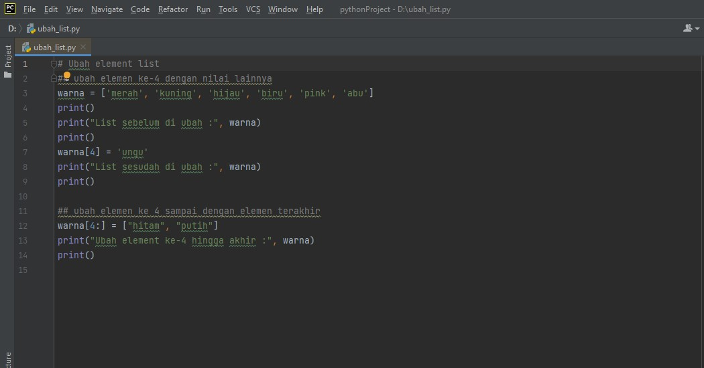
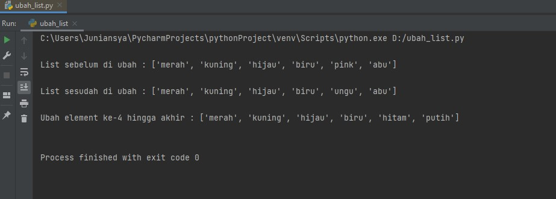
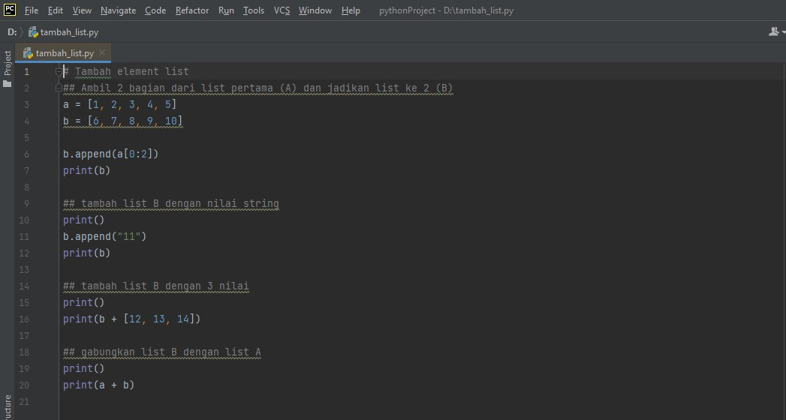
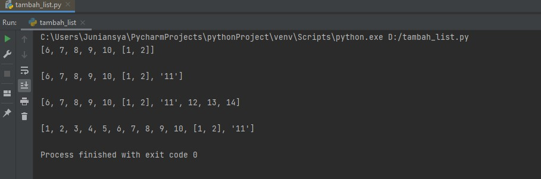
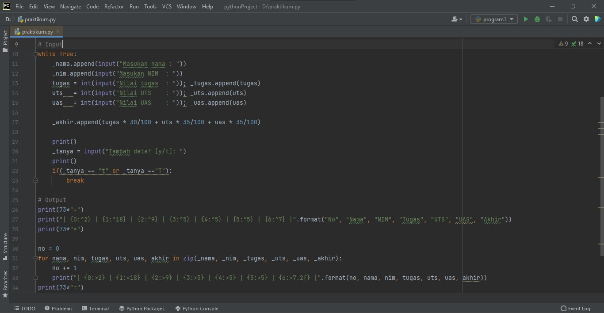
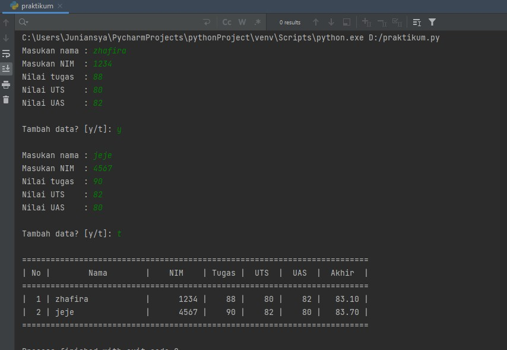

# labspy04
## 2. (Akses/Menambah/Ubah) Sebuah list
## Latihan List

### Akses List
- Tampilkan elemen ke-3
- Ambil nilai elemen ke-2 sampai elemen ke-4
- Ambil elemen terakhir

#### Program


#### Penjelasan
1. Membuat list dengan nilai yang kita inginkan
```python
warna = ['merah', 'kuning', 'hijau', 'biru', 'pink', 'abu']
```

2. Untuk menapilkan semua element yang ada pada list
```python
print("List :", warna)
```

3. Dan untuk menampilkan salah satu element dalam sebuah list, `warna[3]`
```python
print('Warna dalam element ke-3 adalah', warna[3])
```

4. Untuk mengambil nilai element ke-2 sampai ke-4, bisa menggunakan `warna[2:4]`
```python
print(warna[2:4])
```

5. Jika ingin mengambil elemen terakhir dapat menggunakan `warna[-1]`
```python
print(warna[-1])
```

#### Output


###  Ubah List
- Ubah elemen ke-4 dengan nilai lainnya
- Ubah elemen ke-4 sampai dengan elemen terakhir
s1#### Program


#### Penjelasan
1. (Deklarasi List) seperti akses list di atas
```python
warna = ['merah', 'kuning', 'hijau', 'biru', 'pink', 'abu']
```

2. Menampilakn semua elemen yang terdapat pada list diatas, dan mengubah elemen ke-4 dengan nilai lainnya menggunakan `warna[4] = 'ungu'`
```python
print("List sebelum diubah :", warna)
print()
warna[4] = 'ungu'
print("List sesudah diubah :", warna)
```

3. Jika ingin mengubah elemen ke-4 sampai dengan elemen terakhir dapat menggunakan `warna[4:]`
```python
warna[4:] = ["hitam", "putih"]
print("Ubah element ke-4 hingga akhir :", warna)
``s

### Output


### Tambah List
- Ambil 2 bagian dari list pertama (A) dan jadikan list ke-2 (B)
- Tambah list B dengan nilai string
- Tambah list B dengan 3 nilai
- Gabungkan list B dengan list A

#### Program


1. Membuat list dengan variabel `a` dan `b`
```python
a = [1, 2, 3, 4, 5]
b = [6, 7, 8, 9, 10]
```

2.  Untuk mengambil 2 bagian dari list `a`  dan dijadikan list  `b`
```python
b.append(a[0:2])
print(b)
```

3. Untuk menambahkan nilai string ke dalam list `b`
```python
b.append("11")
print(b)
```

4. Untuk menambahkan list  `b` dengan 3 nilai
```python
print(b + [12, 13, 14])
```

5. untuk menggabungkan `a` dan `b`, menggunakan `+`
```python
print()
print(a + b)
```

### Output



## Praktikum
### Program sederhana untuk menambahkan data kedalam sebuat list 
#### Program


#### Penjelasan
1. Mendeklarasi list
```python
_nama = []
_nim = []
_tugas = []
_uts = []
_uas = []
_akhir = []
```

2. Gunakan perulangan _while loop_ dengan nilai "True"
```python
while True:
```

3. Menginput nama, nim, tugas, uts, uas, dan akhir dengan menambahkan method `.append`
```python
 _nama.append(input("Masukan nama : "))
    _nim.append(input("Masukan NIM  : "))
    tugas = int(input("Nilai tugas  : ")); _tugas.append(tugas)
    uts   = int(input("Nilai UTS    : ")); _uts.append(uts)
    uas   = int(input("Nilai UAS    : ")); _uas.append(uas)

    _akhir.append(tugas * 30/100 + uts * 35/100 + uas * 35/100)
```

4. Pada input <b>Tambah Data Lagi?</b> apabila jawaban “t” atau “T”, maka program akan berhenti dan akan menampilkan hasil daftar datanya
```python
_tanya = input("Tambah data lagi? [y/t]: ")
    print()
    if(_tanya == "t" or _tanya =="T"):
        break
```

5. Untuk membuat header table, menggunakan `print(73*"=")`, fungsinya membuat "=" sebanyak 73 sebagai garis, dan menggunakan format string
```python
print(73*"=")
print("| {0:^2} | {1:^18} | {2:^9} | {3:^5} | {4:^5} | {5:^5} | {6:^7} |".format("No", "Nama", "NIM", "Tugas", "UTS", "UAS", "Akhir"))
print(73*"=")
```

6. Deklarasi `no = 0` untuk membuat nomor pada isi table, lalu membuat perulangan dengan `for`
- Perulangan `nama, nim, tugas, uts, uas`, sesuai urutan yang ada di dalam `zip`
- Pada list yang dimaksud, `in zip` berfungsi untuk membungkus semua list
```python
no = 0
for nama, nim, tugas, uts, uas, akhir in zip(_nama, _nim, _tugas, _uts, _uas, _akhir):
```

7. Membuat isi tabel sesuai keinginan dengan format string
```python
no += 1    
    print("| {0:>2} | {1:<18} | {2:>9} | {3:>5} | {4:>5} | {5:>5} | {6:>7.2f} |".format(no, nama, nim, tugas, uts, uas, akhir))
```

8. Untuk membuat footer atau garis paling bawa ketika looping isi table selesai
```python
print(73*"=")
```

#### Output


#### Selesai
